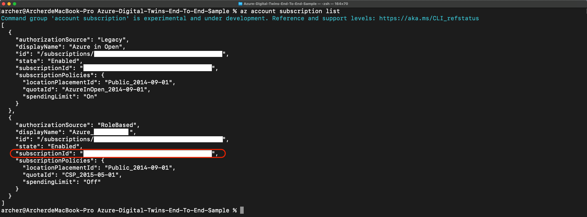
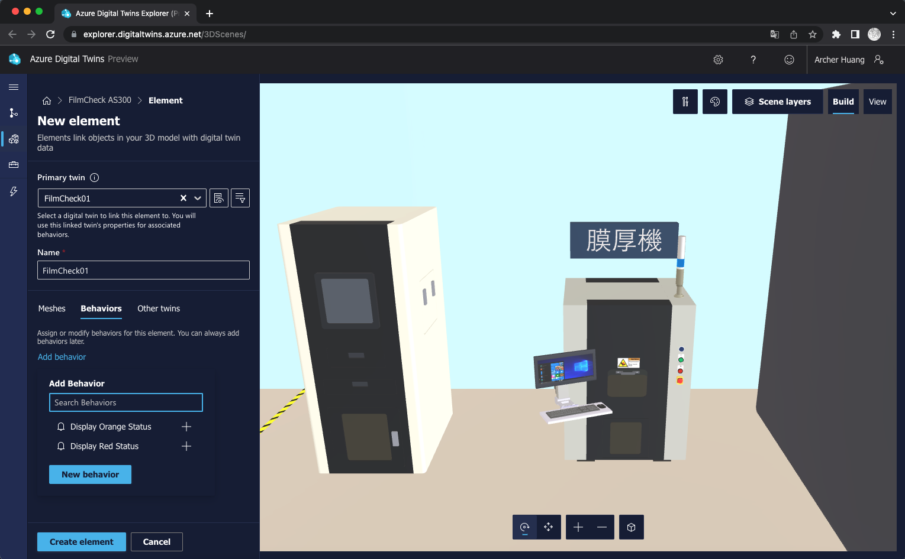
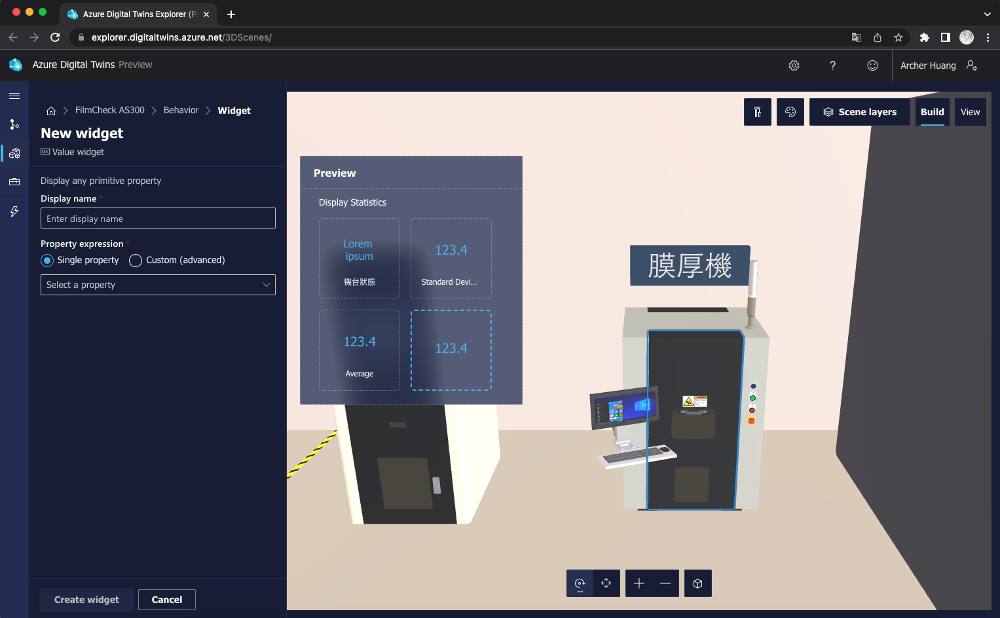
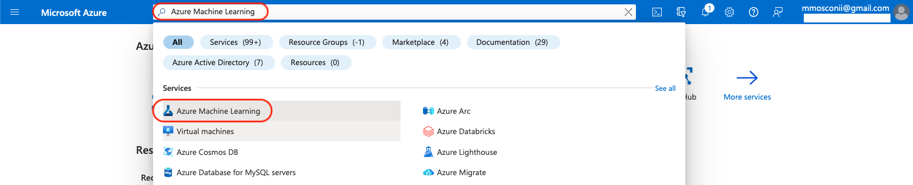
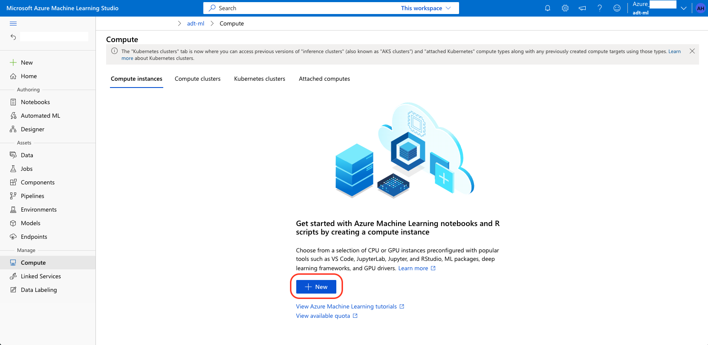
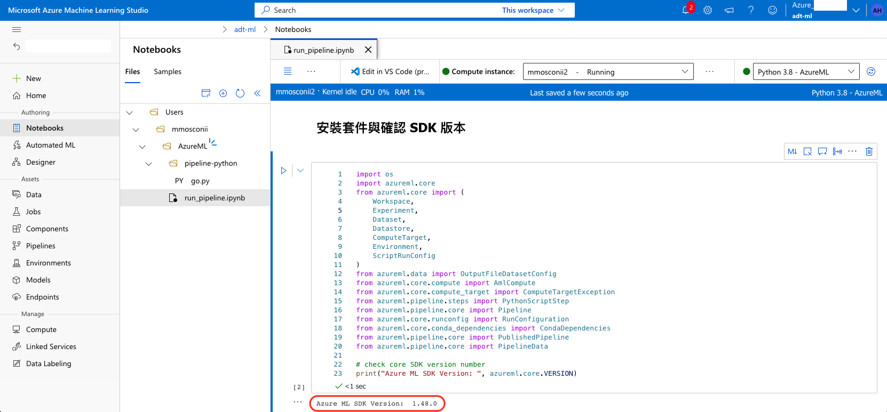

# Azure Digital Twins End-To-End Sample

## Contents
- [Flow](#flow)
- [Semiconductor Film Thickness Measurement System - FilmCheck AS300](#semiconductor-film-thickness-measurement-system---filmcheck-as300)
- [Edge Computing Hardware](#edge-computing-hardware)
- [Azure Cloud service used](#azure-cloud-service-used)
- [Development Environment](#development-environment)
- [Prerequisites](#prerequisites)
- [Digital Twins Definition Language](#digital-twins-definition-language)
- [Data transmission format](#data-transmission-format)
- [The path of the Log & Report & Image in Azure Blob](#the-path-of-the-log--report--image-in-azure-blob)
- [The file structure in the Github repository](#the-file-structure-in-the-github-repository)
- [Step-by-step Guide](#step-by-step-guide)
  - [0. If the prerequisite for the environment is to use Azure Ubuntu VM](#0-if-the-prerequisite-for-the-environment-is-to-use-azure-ubuntu-vm)
  - [1. Preparing the operating environment](#1-preparing-the-operating-environment)
  - [2. Set Environment Variable](#2-set-environment-variable)
  - [3. Create a resource group](#3-create-a-resource-group)
  - [4. Deploying Azure Digital Twin](#4-deploying-azure-digital-twin)
    - [Create an Azure Digital Twin](#)
    - [Get User Principal Name](#)
    - [Set Role Assignment](#)
    - [Check Role Assignment](#)
    - [Upload DTDL Model](#)
    - [Create the Twins](#)
    - [Initial Property](#)
    - [Create a Relationship](#)
    - [List Relationship](#)
    - [Check](#)
  - [5. Create Azure IoT Hub and Create IoT Device](#5-create-azure-iot-hub-and-create-iot-device)
  - [6. Build Azure 3D Scenes Studio](#6-build-azure-3d-scenes-studio)
  - [7. Setting up notifications to be sent through Microsoft Teams](#7-setting-up-notifications-to-be-sent-through-microsoft-teams)
  - [8. Database environment setup and configuration](#8-database-environment-setup-and-configuration)
  - [9. Deploy the Azure Container Apps](#9-deploy-the-azure-container-app)
    - [Upgrade the Azure CLI](#)
    - [Create an Azure Container Registry](#)
    - [List the container registries under the current subscription](#)
    - [Log in to the Azure Container Registry](#)
    - [Create a Docker Image](#)
    - [Check Azure container registry from Browser](#)
    - [Create a Container Apps Environments](#)
    - [Get default Domain](#)
    - [Deploy your image to Azure Container App](#)
  - [10. Deploying the Frontend to Azure Static Web Apps](#10-deploying-the-frontend-to-azure-static-web-apps)
  - [11. Launching the program on the Edge](#11-launching-the-program-on-the-edge)
  - [12. Launch the program for FilmCheck AS300](#12-launch-the-program-for-filmcheck-as300)  
  - [13. Confirming the results from Azure Digital Twins 3D Scenes Studio](#13-confirming-the-results-from-azure-digital-twins-3d-scenes-studio)
  - [14. Confirming the results from the frontend](#14-confirming-the-results-from-the-frontend)
  - [15. Confirming the results from the Microsoft HoloLens](#15-confirming-the-results-from-the-microsoft-hololens)
  - [16. Machine Learning](#16-machine-learning)
- [Reference](#reference)
- [Contributor](#contributors)
- [License](#license)

## Flow
This project contains a sample for working with Azure Digital Twins：

* A building scenario sample written in Vue, Node.js, and Python. The sample can be used to set up and a full end-to-end scenario with Azure Digital Twins.
* The designed flow and architecture is showed as following：
  * Upload the corresponding status and measurement results of the Semiconductor Film Thickness Measurement System (FilmCheck AS300) in [DTDL](https://learn.microsoft.com/zh-tw/azure/digital-twins/concepts-models) format to Azure Digital Twins.
  * Sending the status and measurement results of the Semiconductor Film Thickness Measurement System (FilmCheck AS300) to the edge for analysis and serialization, and then transmitting to Azure IoT Hub.
  * After analyzing the relevant data received from Azure IoT Hub, the program deployed in the Azure Container App writes it into the corresponding property in Azure Digital Twin.
  * Retrieve the corresponding properties from Azure Digital Twins and display them in Azure 3D Scenes Studio.
  * Use Microsoft HoloLens to understand the current status and measurement results of the Semiconductor Film Thickness Measurement System (FilmCheck AS300) through the dashboard deployed in Azure Static Web App.
  * When an error occurs in the Semiconductor Film Thickness Measurement System (FilmCheck AS300), send an alert message to the administrator group in real-time via Microsoft Teams.
  * Upload the logs and reports received from the Semiconductor Film Thickness Measurement System (FilmCheck AS300) on Edge to Azure Blob. When Azure Blob receives the upload event of the report, trigger the Azure Machine Learning pipeline to perform data analysis and generate results, then upload them to Azure Blob.
  * Keyword：
    * Azure IoT Hub, Docker, Azure Container Registry, Azure Container Apps, Azure Digital Twins, Digital Twins Definition Language (DTDL), Azure 3D Scenes Studio, Azure Digital Twins Explorer, Azure App Service, Microsoft HoloLens, Creating a 3D model of a physical object, Babylon.js, Azure Machine Learning, Azure Static Web App, Vue, Azure storage account, Azure Database for PostgreSQL, GitHub, Azure Active Directory and Microsoft Teams.


## Semiconductor Film Thickness Measurement System - FilmCheck AS300
Spectral reflectometer (SR) is a method of characterizing unknown properties of a sample by measuring the reflection of
electromagnetic radiation. The reflected light is collected onto the spectrometer and transfer into spectrum signals. After
the theoretical analysis and signature fitting, the parameters of the sample can be obtained. In our system, it can
measure the parameters of film thickness, (n, k) value, and TSV (through silicon via) depth (option).
* Features
  * Extra film thickness range up to 150 µm
  * Fast alignment with high reliability R - Θ stage
  * Precise measurement location for patterned film
  * Generate map recipe in seconds
  * Double check measurement location by preview color camera
  * Auto focusing for precise measurement
* Specifications
  * Oxide, Nitride, PR, PI film on Si, GaAs, glass, metals substrate
  * Excellent for patterned film with auto mapping
  * Mapping size up to 300 mm wafer
  * Absolute reflectivity measurements
  * Film thickness range: 200 Å ~ 150 µm
  * Repeatability: <br 10 Å @ 5000 Å Oxide on Si substrate
  * Measurement Spot Size: φ40 µm (available others)
  * Wafer size compatibility: 4”, 6”, 8”, 12”
  * SEMI S2 compliance
* [Infomation](https://github.com/ArcherHuang/Azure-Digital-Twins-End-To-End-Sample/blob/main/DM/FilmChek_AS300.png)

## Edge Computing Hardware
* [NVIDIA® Jetson AGX Xavier™](https://www.nvidia.com/zh-tw/autonomous-machines/embedded-systems/jetson-agx-xavier/)

## Azure Cloud service used
* [Azure IoT Hub](https://learn.microsoft.com/en-us/azure/iot-hub/iot-concepts-and-iot-hub)
* [Azure Event Hub](https://learn.microsoft.com/en-us/azure/event-hubs/)
* [Azure Active Directory](https://docs.microsoft.com/en-us/azure/active-directory/fundamentals/)
* [Azure Digital Twins](https://learn.microsoft.com/en-us/azure/digital-twins/)
* [Azure Digital Twins Explorer](https://docs.microsoft.com/en-us/samples/azure-samples/digital-twins-explorer/digital-twins-explorer/)
* [3D Scenes Studio for Azure Digital Twins](https://learn.microsoft.com/en-us/azure/digital-twins/quickstart-3d-scenes-studio)
* [Azure Container Registry](https://azure.microsoft.com/zh-tw/products/container-registry)
* [Azure Container Apps](https://learn.microsoft.com/en-us/azure/container-apps)
* [Azure Machine Learning Studio](https://learn.microsoft.com/zh-tw/azure/machine-learning/overview-what-is-azure-machine-learning)
* [Azure Static Web Apps](https://azure.microsoft.com/en-us/products/app-service/static)
* [Azure Storage Account](https://learn.microsoft.com/en-us/azure/storage/common/storage-account-overview)
* [Azure Database for PostgreSQL](https://azure.microsoft.com/en-us/products/postgresql/)


## Development Environment
| Application |   Development Environment - Hardware / OS  |       Language      |
|:-----------:|:------------------------------------------:|:-------------------:|
|     Edge    |          NVIDIA Jetson AGX Xavier          |      Python 3.6     |
|    Cloud    | MacBook Pro M1 Max (macOS: Ventura 13.0.1) <br> Can also use Azure 20.04 Ubuntu VM| Node v18.13.0 (LTS) |

## Prerequisites
* [Sign in to the Azure portal](https://portal.azure.com/)
* [Install the Azure CLI](https://learn.microsoft.com/en-us/cli/azure/install-azure-cli)
* [Sign in with Azure CLI](https://learn.microsoft.com/en-us/cli/azure/authenticate-azure-cli)
* [Install the Visual Studio Code](https://code.visualstudio.com/download)
* [Install the Docker CLI](https://docs.docker.com/engine/reference/commandline/cli/)
* [Install the pgAdmin](https://www.pgadmin.org/)
* [Sign in to GitHub](https://github.com/)
* [Install Node.js](https://nodejs.org/zh-tw/download/)
* [Install Git and Sign in to GitHub](https://github.com/git-guides/install-git)

## Digital Twins Definition Language
The DTDL model is defined as following 2 sections:
* Lab
```json
{
    "@id": "dtmi:itri:Lab;1",
    "@type": "Interface",
    "@context": "dtmi:dtdl:context;2",
    "displayName": "Lab",
    "contents": [
     {
      "@type": "Relationship",
      "name": "contains",
      "properties": [
       {
        "@type": "Property",
        "name": "targetModel",
        "schema": "string"
       }
      ],
      "target": "dtmi:itri:cms:filmcheck;1"
     }
    ]
   }
```

* Semiconductor Film Thickness Measurement System (FilmCheck AS300)

| Type Error | Machine Status |     Color     |     Annotation       |
|:----------:|:--------------:|:-------------:|:-------------:|
|     -1     |    Shutdown    | Default Color | The program for FilmCheck AS300 has been closed. |
|      0     |      Idle      |     Green     | The program for FilmCheck AS300 has been opened. |
|      1     |  inOperation  |     Orange    | The program for FilmCheck AS300 is currently performing wafer inspection. |
|      2     |      Error     |      Red      | An error occurred during wafer inspection in the program for FilmCheck AS300. |

```json
{
  "@context": [
    "dtmi:dtdl:context;2"
  ],
  "@id": "dtmi:itri:cms:filmcheck;1",
  "@type": "Interface",
  "displayName": "FilmCheck Device",
  "description": "FilmCheck Device",
  "contents": [
    {
      "@type": "Property",
      "name": "statusDate",
      "displayName": "status date",
      "description": "status date",
      "schema": "string"
    },
    {
      "@type": "Property",
      "name": "statusTime",
      "displayName": "status time",
      "description": "status time",
      "schema": "string"
    },
    {
      "@type": "Property",
      "name": "typeError",
      "displayName": "status type",
      "description": "status type",
      "schema": "integer"
    },
    {
      "@type": "Property",
      "name": "statusMessage",
      "displayName": "status message",
      "description": "status message",
      "schema": "string"
    },
    {
      "@type": "Property",
      "name": "statisticsDate",
      "displayName": "statistics date",
      "description": "statistics date",
      "schema": "string"
    },
    {
      "@type": "Property",
      "name": "statisticsTime",
      "displayName": "statistics time",
      "description": "statistics time",
      "schema": "string"
    },
    {
      "@type": "Property",
      "name": "statisticsStandardDeviation",
      "displayName": "statistics standard deviation",
      "description": "statistics standard deviation",
      "schema": "double"
    },
    {
      "@type": "Property",
      "name": "statisticsAverage",
      "displayName": "statistics average",
      "description": "statistics average",
      "schema": "double"
    },
    {
      "@type": "Property",
      "name": "statisticsUniformity",
      "displayName": "statistics uniformity",
      "description": "statistics uniformity",
      "schema": "double"
    },
    {
      "@type": "Property",
      "name": "statisticsMax",
      "displayName": "statistics max",
      "description": "statistics max",
      "schema": "double"
    },
    {
      "@type": "Property",
      "name": "statisticsMin",
      "displayName": "statistics min",
      "description": "statistics min",
      "schema": "double"
    },
    {
      "@type": "Property",
      "name": "statisticsMaxMin",
      "displayName": "statistics max min",
      "description": "statistics max min",
      "schema": "double"
    }
  ]
}
```

## Data transmission format
* Transferring data from the Semiconductor Film Thickness Measurement System to the Edge
  * Shutdown
    ```json
    {
      "date": "2023/02/23",
      "time": "13:43:34",
      "message": "Shutdown: The program is preparing to close."
    }
    ```
  * Idle
    ```json
    {
      "date": "2023/02/23",
      "time": "13:43:34",
      "message": "Idle: The program is already open but wafer inspection has not yet started."
    }
    ```
  * inOperation
    ```json
    {
      "date": "2023/02/23",
      "time": "13:43:34",
      "message": "inOperation: The wafer inspection is in progress."
    }
    ```
  * Error
    ```json
    {
      "date": "2023/02/23",
      "time": "13:43:34",
      "message": "Error: OpenSensor() : Sensor usb device list failed or no sensor present : 0x1"
    }
    ```

* Transferring data from the Edge to Azure IoT Hub

| Type Error | Machine Status (type) |     Color     |     Annotation       |
|:----------:|:--------------:|:-------------:|:-------------:|
|     -1     |    Shutdown    | Default Color | The program for FilmCheck AS300 has been closed. |
|      0     |      Idle      |     Green     | The program for FilmCheck AS300 has been opened. |
|      1     |  inOperation   |     Orange    | The program for FilmCheck AS300 is currently performing wafer inspection. |
|      2     |      Error     |      Red      | An error occurred during wafer inspection in the program for FilmCheck AS300. |

```json
{
	"status": {
		"date": "2023/01/11",
		"time": "09:18:50",
		"type": "Error",
		"message": "-999 Failed to load the configuration file."
	},
	"statistics": {
		"date": "2023/01/11",
		"time": "09:18:50",
		"standardDeviation": 769.93,
		"average": 54954.8,
		"uniformity": 98.599,
		"max": 54954.8,
		"min": 54954.8,
		"maxMin": 54954.8,
		"fileName": "20230220-011029.csv",
	}
}
```

## The path of the Log & Report & Image in Azure Blob
| Type |         Name          |        Azure Blob      |
|:--------------------:|:--------------------:|:------------------------------:|
| Log |     L20230218.log    |   adt3dstorageaccount/adt/Log  |
| Report | 20230220-011029.csv | adt3dstorageaccount/adt/Report |
| Image | 20230220-011029.png | adt3dstorageaccount/adt/Image |

## The file structure in the Github repository
* **待補資訊**

## Step-by-step Guide
### 0. If the prerequisite for the environment is to use Azure Ubuntu VM
* Log in to Azure Ubuntu VM
  ```
  ssh Account@Azure-Ubuntu-VM-IP
  ```

* Download the zip file of the source code
  ```
  git clone https://github.com/ArcherHuang/Azure-Digital-Twins-End-To-End-Sample.git
  ```
  

* Insatll Docker Engine
  * Switch the working directory
    ```
    cd ./Azure-Digital-Twins-End-To-End-Sample/Script
    ```
    

  * Change file permissions
    ```
    chmod 777 install-docker.sh
    ```
    

  * Install Docker
    ```
    sudo ./install-docker.sh
    ```
    

* Install Buildx
  ```
  sudo apt-get install qemu qemu-user-static qemu-user

  mkdir -p ~/.docker/cli-plugins

  sudo docker version --format '{{.Server.Experimental}}' | grep -q 'true' && DOCKER_BUILDKIT=1 || DOCKER_BUILDKIT=0

  curl -SL https://github.com/docker/buildx/releases/download/v0.6.1/buildx-v0.6.1.linux-amd64 -o ~/.docker/cli-plugins/docker-buildx

  chmod a+x ~/.docker/cli-plugins/docker-buildx

  docker buildx install

  docker buildx version
  ```
  

* Install Azure CLI
  ```
  curl -sL https://aka.ms/InstallAzureCLIDeb | sudo bash

  az --version
  ```
  

* Sign in to Azure via AZ CLI
  ```
  az login
  ```

* Get subscription ID
  ```
  az account subscription list
  ```
  

* Switch to the subscription to be used
  ```
  az account set --subscription "SUBSCRIPTION-ID"
  ```

* Install Node.js
  ```
  curl -s https://deb.nodesource.com/setup_16.x | sudo bash

  sudo apt install nodejs -y

  node -v
  ```
  

### 1. Preparing the operating environment
* Commands for macOS environment
  * Download the zip file of the source code
    * Click the `Code` button > Click the `Download ZIP` button
    

  * Unzip the zip file and Switch the working directory to the folder that has been extracted
    ```
    cd ./Azure-Digital-Twins-End-To-End-Sample-main
    ```

* [**Please remember to log in to Azure using Azure CLI.**](https://learn.microsoft.com/en-us/cli/azure/authenticate-azure-cli)

### 2. Set Environment Variable
* Commands for macOS and Ubuntu environment
```
export RESOURCE_GROUP="adt-3d-rg"
export REGION="japaneast"
export ADT_NAME="adt-3d"
export BLOB_NAME="adt3dstorageaccount"
export BLOB_CONTAINER_NAME="adt"
export ACR_NAME="containerforacr"
export ACA_NAME_HUB="adt3dhub"
export ACA_NAME_QUERY="adt3dquery"
export ACA_NAME_BLOB="blobtrigger"
export ACA_NAME_DB_Ops="dbops"
export ACA_ENVIRONMENT_HUB="env-region-containerapps-hub"
export ACA_ENVIRONMENT_QUERY="env-region-containerapps-query"
export ACA_ENVIRONMENT_BLOB="env-region-containerapps-blob"
export ACA_ENVIRONMENT_DB_OPS="env-region-containerapps-db-ops"
export IOT_HUB_NAME="adt-3d"
export IOT_DEVICE_NAME="FilmCheck01"
export IOT_HUB_CONSUMER_GROUP_CONTAINER_APP="containerapp"
export IOT_HUB_CONSUMER_GROUP_STATIC_WEB_APP="forStaticWeb"
export DB_PG_NAME="semiconductor"
export DB_SKU="GP_Gen5_2"
export DB_USER_NAME="azureuser"
export DB_USER_PASSWORD="Pa~w@0rD"

echo $RESOURCE_GROUP
echo $REGION
echo $ADT_NAME
echo $BLOB_NAME
echo $BLOB_CONTAINER_NAME
echo $ACA_NAME_HUB
echo $ACA_NAME_QUERY
echo $ACA_NAME_BLOB
echo $ACA_NAME_DB_Ops
echo $ACA_ENVIRONMENT_HUB
echo $ACA_ENVIRONMENT_QUERY
echo $ACA_ENVIRONMENT_BLOB
echo $ACA_ENVIRONMENT_DB_OPS
echo $IOT_HUB_NAME
echo $IOT_DEVICE_NAME
echo $IOT_HUB_CONSUMER_GROUP_CONTAINER_APP
echo $IOT_HUB_CONSUMER_GROUP_STATIC_WEB_APP
echo $DB_PG_NAME
echo $DB_SKU
echo $DB_USER_NAME
echo $DB_USER_PASSWORD
```


### 3. Create a resource group
* Commands for macOS and Ubuntu environment
  ```
  az group create --name $RESOURCE_GROUP --location $REGION
  ```

  

### 4. Deploying Azure Digital Twin
* Create an Azure Digital Twin
  * Commands for macOS and Ubuntu environment
    ```
    az dt create -n $ADT_NAME -g $RESOURCE_GROUP -l $REGION
    ```

    

* Get Azure Digital Twin Host URL
  * Commands for macOS and Ubuntu environment
  ```
  export ADT_Host_Name=`az dt show --dt-name $ADT_NAME --resource-group $RESOURCE_GROUP --query hostName`

  echo $ADT_Host_Name
  ```

  
  
* Get User Principal Name
```
az ad user list
```


* Set parameter
  * Commands for macOS and Ubuntu environment
    ```
    export USER_PRINCIPAL_NAME="Change it to the userPrincipalName obtained in the previous step."
    
    echo $USER_PRINCIPAL_NAME
    ```

* Set Role Assignment
  * Commands for macOS and Ubuntu environment
    ```
    az dt role-assignment create -n $ADT_NAME --assignee $USER_PRINCIPAL_NAME --role "Azure Digital Twins Data Owner" -g $RESOURCE_GROUP
    ```

    

* Check Role Assignment
  * Commands for macOS and Ubuntu environment
    ```
    az dt role-assignment list -n $ADT_NAME -g $RESOURCE_GROUP
    ```

    

* Upload DTDL Model
  * Commands for macOS and Ubuntu environment
    ```
    az dt model create -n $ADT_NAME --from-directory ./DTDL -g $RESOURCE_GROUP
    ```

    

* Create the Twins
  * Lab
    * Commands for macOS and Ubuntu environment
      ```
      az dt twin create -n $ADT_NAME --dtmi "dtmi:itri:Lab;1" --twin-id DistCtr -g $RESOURCE_GROUP
      ```

      

  * Semiconductor Film Thickness Measurement System (FilmCheck AS300)
    * Commands for macOS and Ubuntu environment
      ```
      az dt twin create -n $ADT_NAME --dtmi "dtmi:itri:cms:filmcheck;1" --twin-id FilmCheck01 -g $RESOURCE_GROUP
      ```

      

* Initial Property
  * Commands for macOS and Ubuntu environment
    ```
    az dt twin update -n $ADT_NAME --twin-id FilmCheck01 --json-patch '[
    {"op":"add", "path":"/statusDate", "value": "0"},
    {"op":"add", "path":"/statusTime", "value": "0"},
    {"op":"add", "path":"/typeError", "value": -1},
    {"op":"add", "path":"/statusMessage", "value": "0"},
    {"op":"add", "path":"/statisticsDate", "value": "0"},
    {"op":"add", "path":"/statisticsTime", "value": "0"},
    {"op":"add", "path":"/statisticsStandardDeviation", "value": 0.0},
    {"op":"add", "path":"/statisticsAverage", "value": 0.0},
    {"op":"add", "path":"/statisticsUniformity", "value": 0.0},
    {"op":"add", "path":"/statisticsMax", "value": 0.0},
    {"op":"add", "path":"/statisticsMin", "value": 0.0},
    {"op":"add", "path":"/statisticsMaxMin", "value": 0.0}
    ]' -g $RESOURCE_GROUP
    ```

    

* Create Relationship
  * Commands for macOS and Ubuntu environment
    ```
    az dt twin relationship create -n $ADT_NAME --relationship-id DistCtr_contains_Relationship_FilmCheck01 --relationship contains --twin-id DistCtr --target FilmCheck01 -g $RESOURCE_GROUP
    ```

    

* List Relationship
  * Commands for macOS and Ubuntu environment
    ```
    az dt twin relationship list -n $ADT_NAME --twin-id DistCtr -g $RESOURCE_GROUP
    ```
    

* Check from Azure Digital Twins Explorer
  * Click the `Open Azure Digital Twins Explorer (preview)` button
    
  * After clicking on `Run Query` in the upper right corner, you will see the results.
    

### 5. Create Azure IoT Hub and Create IoT Device
* Create Azure IoT Hub
  * Commands for macOS and Ubuntu environment
    ```
    az iot hub create --resource-group $RESOURCE_GROUP --name $IOT_HUB_NAME --sku S1 --location $REGION
    ```

    

* Create IoT Device
  * Commands for macOS and Ubuntu environment
    ```
    az iot hub device-identity create --hub-name $IOT_HUB_NAME --device-id $IOT_DEVICE_NAME --resource-group $RESOURCE_GROUP
    ```

    

* Create 2 event hub consumer groups
  * Commands for macOS and Ubuntu environment
    ```
    az iot hub consumer-group create --hub-name $IOT_HUB_NAME --name $IOT_HUB_CONSUMER_GROUP_CONTAINER_APP --resource-group $RESOURCE_GROUP

    az iot hub consumer-group create --hub-name $IOT_HUB_NAME --name $IOT_HUB_CONSUMER_GROUP_STATIC_WEB_APP --resource-group $RESOURCE_GROUP
    ```

    

* Get `FilmCheck01` IoT Device Connection String
  * Commands for macOS and Ubuntu environment
    ```
    az iot hub device-identity connection-string show --hub-name $IOT_HUB_NAME --device-id $IOT_DEVICE_NAME --output table --resource-group $RESOURCE_GROUP
    ```

    

### 6. Build Azure 3D Scenes Studio
* Create Storage Accounts & Container
  * Create Storage Account
    * Commands for macOS and Ubuntu environment
      ```
      az storage account create -n $BLOB_NAME -g $RESOURCE_GROUP -l $REGION --sku Standard_LRS
      ```

      

  * Create Container
    * Commands for macOS and Ubuntu environment
      ```
      az storage container create -n $BLOB_CONTAINER_NAME --account-name $BLOB_NAME --resource-group $RESOURCE_GROUP
      ```

      

  * Change access level
    * Commands for macOS and Ubuntu environment
      ```
      az storage container set-permission --name $BLOB_CONTAINER_NAME --public-access blob --account-name $BLOB_NAME
      ```

      

  * Add Storage Blob Data Owner
    * Retrieve the `subscriptionId` from the results.
      ```
      az account subscription list
      ```

      

    * Set parameter
      * Commands for macOS and Ubuntu environment
        ```
        export SUBSCRIPTION_ID="Enter the subscriptionId obtained in the previous step."

        echo $SUBSCRIPTION_ID
        ```

    * Create a role assignment.
      * Commands for macOS and Ubuntu environment
        ```
        az role assignment create \
            --role "Storage Blob Data Owner" \
            --assignee $USER_PRINCIPAL_NAME \
            --scope "/subscriptions/$SUBSCRIPTION_ID/resourceGroups/$RESOURCE_GROUP/providers/Microsoft.Storage/storageAccounts/$BLOB_NAME"
        ```

        

* Upload 3D Scenes to Studio & Create Twin
  * Enable Cross-Origin Resource Sharing (CORS) for storage account
    * Commands for macOS and Ubuntu environment
      ```
      az storage cors add --services b --methods GET OPTIONS POST PUT --origins https://explorer.digitaltwins.azure.net --allowed-headers Authorization x-ms-version x-ms-blob-type --account-name $BLOB_NAME
      ```

      

  * 3D Scenes Studio
    * Click the `3D Scenes` button
      
    * Click on the pencil icon and Configure the instance and storage container details
      
    * Add a new 3D scene
      * Enter a Name and Description for your scene, and select the `./3D-Scenes/semi-v1.glb` file for uploading.
      
      
    * After the file upload is completed, relevant information can also be viewed in the created blob.
      
    * Once the file is uploaded, you'll see it listed back on the main screen of 3D Scenes Studio
      
    * Select the scene to open and view it. The scene will open in Build mode
      
    * Create a scene element - Create the element for the `Red` color of the tri-color light
      * Select the floor in the scene visualization. This will bring up the possible element actions. Select `+` Create new element - Create the element for the `Red` color of the tri-color light
        
        
        
        
        
        * Display name, enter `Display Red Status`. Under Elements, select Floors.
          
          
        * Select `Visual rules` > `Add Rule`
          
        * Enter a Display name of `Check Red Status`. Leave the Property expression on `Single property` and open the property dropdown list. It contains names of all the properties on the primary twin for the Floor element. Select `typeError`. Then, select `Add condition`.
          
          
        * Add check `typeError` condition
          * `Label name`, enter `Red`.
          * `Values` Fields, Define a value range between `2` and `3` (the min range value is inclusive, and the max value is exclusive), and assign an Element coloring of `Red`. Select `Save`.
          
          
          
          
          
    * Create a scene element - Create the element for the `Orange` color of the tri-color light
      * Select the floor in the scene visualization. This will bring up the possible element actions. Select `+` Create new element - Create the element for the `Orange` color of the tri-color light
        
        
        
        
        
        * Display name, enter `Display Orange Status`. Under Elements, select Floors.
          
          
        * Select `Visual rules` > `Add Rule`
          
        * Enter a Display name of `Check Orange Status`. Leave the Property expression on `Single property` and open the property dropdown list. It contains names of all the properties on the primary twin for the Floor element. Select `typeError`. Then, select `Add condition`.
          
          
        * Add check `typeError` condition
          * `Label name`, enter `Orange`.
          * `Values` Fields, Define a value range between `1` and `2` (the min range value is inclusive, and the max value is exclusive), and assign an Element coloring of `Orange`. Select `Save`.
          
          
          
          
          
    * Create a scene element - Create the element for the `Green` color of the tri-color light
      * Select the floor in the scene visualization. This will bring up the possible element actions. Select `+` Create new element - Create the element for the `Green` color of the tri-color light
        
        
        
        
        
        * Display name, enter `Display Green Status`. Under Elements, select Floors.
          
          
        * Select `Visual rules` > `Add Rule`
          
        * Enter a Display name of `Check Green Status`. Leave the Property expression on `Single property` and open the property dropdown list. It contains names of all the properties on the primary twin for the Floor element. Select `typeError`. Then, select `Add condition`.
          
          
        * Add check `typeError` condition
          * `Label name`, enter `Green`.
          * `Values` Fields, Define a value range between `0` and `1` (the min range value is inclusive, and the max value is exclusive), and assign an Element coloring of `Green`. Select `Save`.
          
          
          
          
          
    * Create new element for display Statistics
      * Select the floor in the scene visualization. This will bring up the possible element actions. Select `+` Create new element
        
        
        
        
        
      * Display name, enter `Display Statistics`. Under Elements, select Floors.
        
        
      * Add `Status` widget
        * Select `Widgets` > `Add widget`
          
        * Select the `Value` widget and select `Add widget`.
          
        * In the New widget options, add a Display name of `機台狀態` and a `Custom (advanced)` Property expression of PrimaryTwin.typeError == 2 ? `目前機台發生錯誤, ${PrimaryTwin.statusMessage}`: '目前機台正常運作', Type is `string`
          
          
      * Add `Standard Deviation` widget
        * select `Add widget`.
          
        * Select the `Value` widget and select `Add widget`.
          
        * In the New widget options, add a Display name of `Standard Deviation` and a `Custom (advanced)` Property expression of `PrimaryTwin.statisticsStandardDeviation == 0 ? '目前尚無資料': PrimaryTwin.statisticsStandardDeviation`, Type is `double`
          
          
      * Add `Average` widget
        * select `Add widget`.
          
        * Select the `Value` widget and select `Add widget`.
          
        * In the New widget options, add a Display name of `Average` and a `Custom (advanced)` Property expression of `PrimaryTwin.statisticsAverage == 0 ? '目前尚無資料': PrimaryTwin.statisticsAverage`, Type is `double`
          
          
      * Add `Uniformity` widget
        * select `Add widget`.
          
        * Select the `Value` widget and select `Add widget`.
          
        * In the New widget options, add a Display name of `Uniformity` and a `Custom (advanced)` Property expression of `PrimaryTwin.statisticsUniformity == 0 ? '目前尚無資料': PrimaryTwin.statisticsUniformity`, Type is `double`
          
          
      * Add `Max` widget
        * select `Add widget`.
          
        * Select the `Value` widget and select `Add widget`.
          
        * In the New widget options, add a Display name of `Max` and a `Custom (advanced)` Property expression of `PrimaryTwin.statisticsMax == 0 ? '目前尚無資料': PrimaryTwin.statisticsMax`, Type is `double`
          
          
      * Add `Min` widget
        * select `Add widget`.
          
        * Select the `Value` widget and select `Add widget`.
          
        * In the New widget options, add a Display name of `Min` and a `Custom (advanced)` Property expression of `PrimaryTwin.statisticsMin == 0 ? '目前尚無資料': PrimaryTwin.statisticsMin`, Type is `double`
          
          
      * Add `Max Min` widget
        * select `Add widget`.
          
        * Select the `Value` widget and select `Add widget`.
          
        * In the New widget options, add a Display name of `Max Min` and a `Custom (advanced)` Property expression of `PrimaryTwin.statisticsMaxMin == 0 ? '目前尚無資料': PrimaryTwin.statisticsMaxMin`, Type is `double`
          
          
        * click `Create behavior`
          
    * View scene
      * So far, you've been working with 3D Scenes Studio in Build mode. Now, switch the mode to View.
        

### 7. Setting up notifications to be sent through Microsoft Teams

* Click the `建立團隊` button


* Click the `其他` button


* Please enter a unique and identifiable name in the `團隊名稱` field, and click `下一步` after you have finished entering it.


* During the team creation process


* Click the `略過` button


* Creation completed


* Click the `連接器` button in the `...` menu at the top right corner. (The `連接器` option will appear in a moment, please wait.)


* Click the `新增` button on the right side of `傳入 Webhook`


* Click the `新增` button


* Click the `連接器` button in the `...` menu at the top right corner


* Click the `設定` button on the right side of `傳入 Webhook`


* Please enter a unique and identifiable name in the `Incoming Webhook` field, and click `建立` after you have finished entering it.


* After creation is completed, please copy the `URL` and then click the `完成` button

  * Commands for macOS and Ubuntu environment
    ```
    export WEBHOOK_URL='Paste the copied URL'

    echo $WEBHOOK_URL
    ```

    

* Configuration completed


### 8. Database environment setup and configuration
* Create a server
  * Commands for macOS and Ubuntu environment
    ```
    az postgres server create --name $DB_PG_NAME --resource-group $RESOURCE_GROUP --location $REGION --admin-user $DB_USER_NAME --admin-password $DB_USER_PASSWORD --sku-name $DB_SKU --version 11 --ssl-enforcement Enabled
    ```

    

* Allow access to Azure Services
  * Commands for macOS and Ubuntu environment
    ```
    az postgres server firewall-rule create --resource-group $RESOURCE_GROUP \
      --server-name "$DB_PG_NAME" \
      --name "allow-azure-internal" \
      --start-ip-address 0.0.0.0 \
      --end-ip-address 0.0.0.0
    ```

    

* Get the local IP address.
  * Commands for macOS and Ubuntu environment
      ```
      export LOCAL_IP=`curl ifconfig.me`

      echo $LOCAL_IP
      ```

      

* Configure a server-based firewall rule
  * Commands for macOS and Ubuntu environment
    ```
    az postgres server firewall-rule create --resource-group $RESOURCE_GROUP --server $DB_PG_NAME --name AllowLocalIp --start-ip-address $LOCAL_IP --end-ip-address $LOCAL_IP
    ```

    

* Get the server name and the admin username


* Create a database
  * Open the `pgAdmin` software
    
  * Right-click the `Servers` button > Click the `Register` button > Click the `Server...` button
    
  * Enter a recognizable name in the `Name` field
    
  * Enter relevant information on the `Connection` tab
    * In the `Host name` field, enter the `Server name` obtained from the `Get the server name and the admin username` section.
    * In the `Username` field, enter the `Admin username` obtained from the `Get the server name and the admin username` section.
    * In the `Password` field, enter the password you have set.
    * After entering the above information, click the `Save` button.
    
    * If login fails, please reset your password.
    
  * Establish `FilmCheck` Database
    * Right-click the `Databases` button > Click the `Create` button > Click the `Database...` button
    
    * Enter `FilmCheck` in the `Database` field.
    * After entering the above information, click the `Save` button.
    
    * Completion screen created
    

* Create the Log and Report Table
  * Switch working directory
    ```
    cd ./AzureContainerApp/DB_Ops
    ```
  * Install required packages
    ```
    npm i
    ```

    

  * Modify the content of `development` in the `config/config.json` file (**username**、**password**、**database**)
  ```json
  {
    "development": {
      "username": "Please modify it with the information obtained earlier.",
      "password": "Please modify it with the information obtained earlier.",
      "database": "Please modify it with the information obtained earlier.",
      "host": "Please modify it with the information obtained earlier.",
      "dialect": "postgres",
      "ssl": true,
      "dialectOptions": {
        "ssl": {
          "require": true
        }
      }
    },
  }
  ```

  * Create the Tables
    ```
    npx sequelize db:migrate --env development
    ```

    
  * Open Query Tool
    * Right-click on the created database > Click the `Query Tool`
    

    * Query Tool
    
  * Check the Log Table
    ```sql
    SELECT * FROM public."Logs"
    ```
    
  * Check the Report Table
    ```sql
    SELECT * FROM public."Reports"
    ```
    
  * Check the Status Table
    ```sql
    SELECT * FROM public."Statuses"
    ```
    

### 9. Deploy the Azure Container App
* Upgrade the Azure CLI
```
az upgrade
az config set auto-upgrade.enable=yes
az extension add --name containerapp --upgrade
```

* Create an Azure Container Registry
  * Commands for macOS and Ubuntu environment
    ```
    az acr create \
      --resource-group $RESOURCE_GROUP \
      --name $ACR_NAME \
      --sku Basic \
      --admin-enabled true
    ```

    

* List the container registries under the current subscription
  * Commands for macOS and Ubuntu environment
    ```
    az acr list \
      -o table \
      -g $RESOURCE_GROUP
    ```

    

* Log in to the Azure Container Registry
  * Commands for macOS and Ubuntu environment
    ```
    az acr login --name $ACR_NAME

    --- Ubuntu
    az acr credential show --name containerforacr.azurecr.io --query passwords[0].value --output tsv

    sudo az acr login

    Username: containerforacr
    Password: 
    ```

    

* Switch working directory (IoT Hub To ADT)
```
cd ../IoTHub_To_ADT_Notify
```

* Modify the content of `development` in the `config/config.json` file (**username**、**password**、**database**)
  ```json
  {
    "development": {
      "username": "Please modify it with the information obtained earlier.",
      "password": "Please modify it with the information obtained earlier.",
      "database": "Please modify it with the information obtained earlier.",
      "host": "Please modify it with the information obtained earlier.",
      "dialect": "postgres",
      "ssl": true,
      "dialectOptions": {
        "ssl": {
          "require": true
        }
      }
    },
  }
  ```

* Create a Docker Image (IoT Hub To ADT)
  * Commands for macOS and Ubuntu environment
    ```
    sudo docker buildx build . --platform linux/amd64 --push -t $ACR_NAME.azurecr.io/hub-to-adt-notify:0.1 -f docker-manifests/Dockerfile
    ```

    

* Check Azure container registry from Browser


* Create a Container Apps Environments (IoT Hub To ADT)
  * Commands for macOS and Ubuntu environment
    ```
    az containerapp env create \
      --name $ACA_ENVIRONMENT_HUB \
      --resource-group $RESOURCE_GROUP \
      --location $REGION
    ```

    

* Get default Domain (IoT Hub To ADT)
  * Commands for macOS and Ubuntu environment
    ```
    az containerapp env show \
      --name $ACA_ENVIRONMENT_HUB \
      --resource-group $RESOURCE_GROUP
    ```

    

* Set parameters
  * Get Build-in Event Hub-compatible endpoint
    * Commands for macOS and Ubuntu environment
      ```
      az iot hub connection-string show --hub-name $IOT_HUB_NAME --default-eventhub --resource-group $RESOURCE_GROUP --query connectionString

      export EVENTHUB_CONNECTION_STRING="Enter the connectionString obtained in the previous step."

      echo $EVENTHUB_CONNECTION_STRING
      ```

      

  * Get Azure Digital Twin Host URL
    * Commands for macOS and Ubuntu environment
    ```
    az dt show --dt-name $ADT_NAME --resource-group $RESOURCE_GROUP --query hostName

    export ADT_Host_Name="Enter the Azure Digital Twin Host URL obtained in the previous step."

    echo $ADT_Host_Name
    ```

    

* Confirm parameters
  ```
  echo $ADT_NAME
  echo $IOT_HUB_CONSUMER_GROUP_CONTAINER_APP
  echo $EVENTHUB_CONNECTION_STRING
  echo $ADT_Host_Name
  echo $WEBHOOK_URL
  ```

  

* Deploy the image to Azure Container App (IoT Hub To ADT)
  * Commands for macOS and Ubuntu environment
    ```
    az containerapp create \
      --name $ACA_NAME_HUB \
      --resource-group $RESOURCE_GROUP \
      --environment $ACA_ENVIRONMENT_HUB \
      --registry-server $ACR_NAME.azurecr.io \
      --image $ACR_NAME.azurecr.io/hub-to-adt-notify:0.1 \
      --env-vars "EVENTHUB_NAME=secretref:eventhub-name" "CONSUMER_GROUP_NAME=secretref:consumer-group-name" "EVENTHUB_CONNECTION_STRING=secretref:eventhub-connection-string" "ADT_Host_Name=secretref:adt-host-name" "WEBHOOK_URL=secretref:webhook-url" \
      --secrets "eventhub-name=$ADT_NAME" "consumer-group-name=$IOT_HUB_CONSUMER_GROUP_CONTAINER_APP" "eventhub-connection-string=$EVENTHUB_CONNECTION_STRING" "adt-host-name=$ADT_Host_Name" "webhook-url=$WEBHOOK_URL" \
      --min-replicas 1 \
      --max-replicas 1 \
      --ingress 'internal' \
      --target-port 3000 \
      --query properties.configuration.ingress.fqdn

    "adt3dhub.internal.proudsky-415d04fa.japaneast.azurecontainerapps.io"
    ```

    

* Set role assignment
  * Enable System assigned
    * Commands for macOS and Ubuntu environment
      ```
      az containerapp identity assign -g $RESOURCE_GROUP -n $ACA_NAME_HUB --system-assigned
      ```

      

  * Add role assignment
    * Click on the created `adt3dhub` in the `Container App` on the `Azure portal` > Click on `Identity` in the left-hand menu > Click on `Azure role assignments`
    

    * Click on the `+ Add role assignment (Preview)` button
      
      * Enter the relevant information
        * Select `Subscription` in the `Scope` field.
        * Select the desired subscription in the `Subscription` field.
        * Select `Azure Digital Twins Data Owner` in the `Role` field.
        * After entering the above information, click on the `Save` button.

* Switch working directory (Query ADT)
```
cd ../Query_ADT
```

* Create a Container Apps Environments (Query ADT)
  * Commands for macOS and Ubuntu environment
    ```
    az containerapp env create \
      --name $ACA_ENVIRONMENT_QUERY \
      --resource-group $RESOURCE_GROUP \
      --location $REGION
    ```

    

* Get default Domain (Query ADT)
  * Commands for macOS and Ubuntu environment
    ```
    az containerapp env show \
      --name $ACA_ENVIRONMENT_QUERY \
      --resource-group $RESOURCE_GROUP
    ```

    

* Create the Query ADT Docker Image (Query ADT)
  * Commands for macOS and Ubuntu environment
    ```
    sudo docker buildx build . --platform linux/amd64 --push -t $ACR_NAME.azurecr.io/query-adt:0.2 -f docker-manifests/Dockerfile
    ```

    

* Confirm parameters
  * Commands for macOS and Ubuntu environment
    ```
    echo $ADT_Host_Name

    export ADT_Host_Name="adt-3d.api.jpe.digitaltwins.azure.net"
    ```

    

* Deploy the Query ADT image to Azure Container App (Query ADT)
  * Please remember the URL returned after executing the command.
    * Commands for macOS and Ubuntu environment
      ```
      az containerapp create \
        --name $ACA_NAME_QUERY \
        --resource-group $RESOURCE_GROUP \
        --environment $ACA_ENVIRONMENT_QUERY \
        --registry-server $ACR_NAME.azurecr.io \
        --image $ACR_NAME.azurecr.io/query-adt:0.2 \
        --env-vars "ADT_Host_Name=secretref:adt-host-name" \
        --secrets "adt-host-name=$ADT_Host_Name" \
        --min-replicas 1 \
        --max-replicas 1 \
        --ingress 'external' \
        --target-port 80 \
        --query properties.configuration.ingress.fqdn

      "adt3dquery.kindpebble-e066fde2.japaneast.azurecontainerapps.io"
      ```

      

* Set parameter
  * Commands for macOS and Ubuntu environment
    ```
    export QUERY_ADT_URL="Enter the URL obtained in the previous step."

    echo $QUERY_ADT_URL
    ```

* Set role assignment (Query ADT)
  * Enable System assigned
    * Commands for macOS and Ubuntu environment
      ```
      az containerapp identity assign -g $RESOURCE_GROUP -n $ACA_NAME_QUERY --system-assigned
      ```

      

  * Add role assignment
    * Click on the created `adt3dquery` in the `Container App` on the `Azure portal` > Click on `Identity` in the left-hand menu > Click on `Azure role assignments`
    

    * Click on the `+ Add role assignment (Preview)` button
      
      * Enter the relevant information
        * Select `Subscription` in the `Scope` field.
        * Select the desired subscription in the `Subscription` field.
        * Select `Azure Digital Twins Data Owner` in the `Role` field.
        * After entering the above information, click on the `Save` button.

* Test (Query ADT)
```
https://adt3dquery.kindpebble-e066fde2.japaneast.azurecontainerapps.io/hello

https://adt3dquery.kindpebble-e066fde2.japaneast.azurecontainerapps.io/adt/query/statistics
```

* Switch working directory (DB Ops)
```
cd ../DB_Ops
```

* Modify the content of `development` in the `config/config.json` file (**username**、**password**、**database**)
  ```json
  {
    "development": {
      "username": "Please modify it with the information obtained earlier.",
      "password": "Please modify it with the information obtained earlier.",
      "database": "Please modify it with the information obtained earlier.",
      "host": "Please modify it with the information obtained earlier.",
      "dialect": "postgres",
      "ssl": true,
      "dialectOptions": {
        "ssl": {
          "require": true
        }
      }
    },
  }
  ```

* Create the Query ADT Docker Image (DB Ops)
  * Commands for macOS and Ubuntu environment
    ```
    sudo docker buildx build . --platform linux/amd64 --push -t $ACR_NAME.azurecr.io/db-ops:0.1 -f docker-manifests/Dockerfile
    ```

    

* Create a Container Apps Environments (DB Ops)
  * Commands for macOS and Ubuntu environment
    ```
    az containerapp env create \
      --name $ACA_ENVIRONMENT_DB_OPS \
      --resource-group $RESOURCE_GROUP \
      --location $REGION
    ```

    

* Deploy the Query ADT image to Azure Container App (DB Ops)
  * Please remember the URL returned after executing the command.
    * Commands for macOS and Ubuntu environment
      ```
      az containerapp create \
        --name $ACA_NAME_DB_Ops \
        --resource-group $RESOURCE_GROUP \
        --environment $ACA_ENVIRONMENT_DB_OPS \
        --registry-server $ACR_NAME.azurecr.io \
        --image $ACR_NAME.azurecr.io/db-ops:0.1 \
        --min-replicas 1 \
        --max-replicas 1 \
        --ingress 'external' \
        --target-port 80 \
        --query properties.configuration.ingress.fqdn

      "dbops.victoriousground-728f9a8f.japaneast.azurecontainerapps.io"
      ```

      

* Set parameter
  * Commands for macOS and Ubuntu environment
    ```
    export DB_OPS_API_URL="Enter the URL obtained in the previous step."
    
    echo $DB_OPS_API_URL
    ```

* Test (DB Ops)
  * https://dbops.victoriousground-728f9a8f.japaneast.azurecontainerapps.io
  * https://dbops.victoriousground-728f9a8f.japaneast.azurecontainerapps.io/logs
  * https://dbops.victoriousground-728f9a8f.japaneast.azurecontainerapps.io/reports
  * https://dbops.victoriousground-728f9a8f.japaneast.azurecontainerapps.io/status/latest
  * https://dbops.victoriousground-728f9a8f.japaneast.azurecontainerapps.io/reports/latest

### 10. Deploying the Frontend to Azure Static Web Apps
* Deploy files from the `./Azure-Digital-Twins-End-To-End-Sample/Frontend` folder to [GitHub](https://github.com/).
  
* Click the `Settings` > Click the `Secrets and variables` > Click the `Actions` > Click the `New repository secret`
  
* Add the following `secret`
  * Add `VUE_APP_EVENTHUB_NAME`
    
    * Enter `VUE_APP_EVENTHUB_NAME` in the Name field.
    * Enter the string displayed by `echo $ADT_NAME` in the `Secret` field. (Windows: Enter the string displayed by `echo $AdtName` in the `Secret` field.)
    * After entering the above information, click the `Add secret` button.
  * Add `VUE_APP_CONSUMER_GROUP_NAME`
    
    * Enter `VUE_APP_CONSUMER_GROUP_NAME` in the Name field.
    * Enter the string displayed by `echo $IOT_HUB_CONSUMER_GROUP_STATIC_WEB_APP` in the `Secret` field. (Windows: Enter the string displayed by `echo $IotHubConsumerGroupStaticWebApp` in the `Secret` field.)
    * After entering the above information, click the `Add secret` button.  

  * Add `VUE_APP_EVENTHUB_CONNECTION_STRING`
    * Get Build-in Event Hub-compatible endpoint
      ```
      az iot hub connection-string show --hub-name $IOT_HUB_NAME --default-eventhub --resource-group $RESOURCE_GROUP --query connectionString
      ```
      

    * Add Secret
      
      * Enter `VUE_APP_EVENTHUB_CONNECTION_STRING` in the Name field.
      * Enter the result displayed in the previous step in the `Secret` field.
      * After entering the above information, click the `Add secret` button.  
  
  * Add `VUE_APP_API_URL` (ACA - DB Ops)
    <!---
    ```
    https://${process.env.VUE_APP_API_URL}/logs

    https://dbops.orangemushroom-635ae7f2.japaneast.azurecontainerapps.io/logs
    https://dbops.orangemushroom-635ae7f2.japaneast.azurecontainerapps.io/reports
    ```
    --->

    
    * Enter `VUE_APP_API_URL` in the Name field.
    * Enter the string displayed by `echo $DB_OPS_API_URL` in the `Secret` field. (Windows: Enter the string displayed by `echo $DbOpsApiUrl` in the `Secret` field.)
    * After entering the above information, click the `Add secret` button.

  * Add `VUE_APP_BLOB_NAME`
    <!---
    ```
    echo $BLOB_NAME

    https://${process.env.VUE_APP_BLOB_NAME}.blob.core.windows.net/adt/Log/log.txt
    ```
    --->

    
    * Enter `VUE_APP_BLOB_NAME` in the Name field.
    * Enter the string displayed by `echo $BLOB_NAME` in the `Secret` field. (Windows: Enter the string displayed by `echo $BlobName` in the `Secret` field.)
    * After entering the above information, click the `Add secret` button.

  * Add `VUE_APP_QUERY_ADT_URL` (ACA - Query ADT)
    <!---
    ```
    https://${process.env.VUE_APP_QUERY_ADT_URL}/adt/query/statistics

    https://adt3dquery.salmonglacier-bbefa691.japaneast.azurecontainerapps.io/adt/query/statistics
    ```
    --->

    
    * Enter `VUE_APP_QUERY_ADT_URL` in the Name field.
    * Enter the string displayed by `echo $QUERY_ADT_URL` in the `Secret` field. (Windows: Enter the string displayed by `echo $QueryAdtUrl` in the `Secret` field.)
    * After entering the above information, click the `Add secret` button.

* Enter `Static Web App` in the search box of the `Azure Portal`. > Select the search result for `Static Web Apps`.
  

* Click the `+ Create` button at the top.
  

* Enter the relevant information.
  

* Confirm the entered information.
  

* Creation completed.
  

* After modifying `./ADT_Web/tree/main/.github/workflows/azure-static-web-apps-Random-Number.yml`, commit the changes (You can see this file from the GitHub repository). Add the information in the `env:` section below (Please align the format).
  ```yaml
  jobs:
    build_and_deploy_job:
      if: ...
      runs-on: ubuntu-latest
      name: Build and Deploy Job
      steps:
        - uses: actions/checkout@v2
          with:
            submodules: true
        - name: Build And Deploy
          id: builddeploy
          uses: Azure/static-web-apps-deploy@v1
          with:
            ...
          env:
            VUE_APP_EVENTHUB_NAME: ${{ secrets.VUE_APP_EVENTHUB_NAME }}
            VUE_APP_CONSUMER_GROUP_NAME: ${{ secrets.VUE_APP_CONSUMER_GROUP_NAME }}
            VUE_APP_EVENTHUB_CONNECTION_STRING: ${{ secrets.VUE_APP_EVENTHUB_CONNECTION_STRING }}
            VUE_APP_API_URL: ${{ secrets.VUE_APP_API_URL }}
            VUE_APP_BLOB_NAME: ${{ secrets.VUE_APP_BLOB_NAME }}
            VUE_APP_QUERY_ADT_URL: ${{ secrets.VUE_APP_QUERY_ADT_URL }}
  ```

* Confirm the status from GitHub actions.
  

* Obtain the URL of the `Static Web App`.
  

### 11. Launching the program on the Edge
* Download the zip file of the source code to the edge and unzip it..
  * Please [refer to the instructions](https://github.com/ArcherHuang/Azure-Digital-Twins-End-To-End-Sample#1-preparing-the-operating-environment) on how to download the zip file of the source code. 

* Install Mosquitto MQTT Broker On Ubuntu Edge
```
sudo apt update 
sudo apt install -y mosquitto
```

* Change directory
```
cd ./Edge
```

* Install Python packages with pip and requirements.txt
```
pip3 install -r requirements.txt
```
* Get FilmCheck01 IoT Device Connection String
```
az iot hub device-identity connection-string show --hub-name $IOT_HUB_NAME --device-id $IOT_DEVICE_NAME --output table --resource-group $RESOURCE_GROUP
```


* Get the Connection string for the blob
  * Perform operations on the created blob.


* Get the container name for the blob
  * Perform operations on the created blob.


* Create `.env` File and Add the following information.
```
IOT_HUB_DEVICE_CONNECTION_STRING="Enter the result obtained from the Get FilmCheck01 IoT Device Connection String."
BLOB_CONNECTION_STRING="Enter the result obtained from the Get the Connection string for the blob."
BLOB_CONTAINER_NAME="Enter the result obtained from the Get the container name for the blob."
```

* Run Code
```
python3 edge.py
```


* After receiving the log information from FilmCheck AS300, Edge will store the log information locally and upload it to Azure Blob at 5:00 every day. Similarly, upon receiving the report information from FilmCheck AS300, Edge will store the report information locally and upload it to Azure Blob in real-time.


### 12. Launch the program for FilmCheck AS300
* FilmCheck AS300 operation screen


### 13. Confirming the results from Azure Digital Twins 3D Scenes Studio


### 14. Confirming the results from the Frontend
* https://zealous-tree-035510510.2.azurestaticapps.net/#/

* Machine idle


* Machine running


* Machine malfunction


* Machine statistics information


### 15. Confirming the results from the Microsoft HoloLens


### 16. Machine Learning
* Enter `Azure Machine Learning` in the search box above and click on `Azure Machine Learning` in the search results.


* Click on the `+ Create` button in the upper left corner. > Then click on `New Workspace`.


* Enter the relevant information.


* After verifying the relevant information, click on `Create` in the lower left corner.


* During the creation process.


* After the creation is completed, please click on `Go to resource`.


* Click on `Launch studio`.


* Click on `Compute` on the left side to create a compute resource.


* Click on the `+ New` button below.


* After selecting the desired `CPU` or `GPU` specifications, click on `Create` below.


* During the creation process


* Click on `Notebooks` in the upper left corner.


* Create a notebook.
  * Click on the `⊕` symbol. > Then click on `Upload folder`.
    

  * Click on `Click to browse and select folder(s)`.
    

  * Upload the files from the `Azure-Digital-Twins-End-To-End-Sample/AzureML`.
    

  * Click on `Upload`.
      

  * Click on `Upload`.
    

  * Upload completed.
    

* Click on `run_pipeline.ipynb`.


* Click on the `Python 3.8 - AzureML` execution environment in the upper right corner (green light indicates it is running).


* Confirm that the `Compute instance` is running (green light indicates it is running).


* The relevant code
  * Execute the `安裝套件與確認 SDK 版本` code block.
    * Click on the left side `▷` symbol.
      
    * The execution result
      

  * Execute the `配置工作環境` code block.
    * Click on the left side `▷` symbol.
      
    * The execution result
      

  * Execute the `連接已有的 Blob` code block.
    * Modify lines 3, 4, and 5.
      
      * Replace the right-hand side of the equal sign in `line 3` with the created blob container.
        

      * Replace the right-hand side of the equal sign in `line 4` with the obtained `Storage account name`.
        

      * Replace the right side of the equal sign in `line 5` with the obtained `Key`.
        

    * Click on the left side `▷` symbol.
      
    * The execution result
      

  * Execute the `建立運算叢集` code block.
    * Click on the left side `▷` symbol.
      
    * The execution result
      

  * Execute the `設定執行環境的 config` code block.
    * Click on the left side `▷` symbol.
      
    * The execution result
      

  * Execute the `建立 Python 腳本步驟` code block.
    * Click on the left side `▷` symbol.
      
    * The execution result
      

  * Execute the `部署成 pipeline 與儲存 pipeline ID` code block.
    * Click on the left side `▷` symbol.
      
    * The execution result
      

* Create an `AzureML Pipeline` that is triggered when a report file is uploaded to `Blob`.
  * Click on the `Pipelines` button on the left-hand side. > Click on the `Pipeline endpoints` button at the top. > Click on the `blob-trigger-pipeline`.
    

  * Copy the URL under `REST endpoints`
    

  * Set parameters
    * EXPERIMENT_NAME
      * Commands for macOS and Ubuntu environment
        ```
        export EXPERIMENT_NAME='blob-trigger-pipeline'
        echo $EXPERIMENT_NAME
        ```

        

    * TRIGGER_ML_ENDPOINT
      * Commands for macOS and Ubuntu environment
        ```
        export TRIGGER_ML_ENDPOINT='上步驟所取得的 URL'
        echo $TRIGGER_ML_ENDPOINT
        ```

        

  * Switch working directory (Blob Trigger)
    ```
    cd ../Blob_Trigger
    ```

  * Modify the content of `development` in the `config/config.json` file (**username**、**password**、**database**)
    ```json
    {
      "development": {
        "username": "Please modify it with the information obtained earlier.",
        "password": "Please modify it with the information obtained earlier.",
        "database": "Please modify it with the information obtained earlier.",
        "host": "Please modify it with the information obtained earlier.",
        "dialect": "postgres",
        "ssl": true,
        "dialectOptions": {
          "ssl": {
            "require": true
          }
        }
      },
    }
    ```

  * Create a Blob Trigger Container Apps Environments (Blob Trigger)
    * Commands for macOS and Ubuntu environment
      ```
      az containerapp env create \
        --name $ACA_ENVIRONMENT_BLOB \
        --resource-group $RESOURCE_GROUP \
        --location $REGION
      ```

      

  * Get default Domain (Blob Trigger)
    * Commands for macOS and Ubuntu environment
      ```
      az containerapp env show \
        --name $ACA_ENVIRONMENT_BLOB \
        --resource-group $RESOURCE_GROUP
      ```

      

  * Create the Blob Trigger Docker Image (Blob Trigger)
    * Commands for macOS and Ubuntu environment
      ```
      sudo docker buildx build . --platform linux/amd64,linux/arm64 --push -t $ACR_NAME.azurecr.io/blob-trigger:0.1 -f docker-manifests/Dockerfile

      sudo docker buildx build . --platform linux/amd64 --push -t $ACR_NAME.azurecr.io/blob-trigger:0.1 -f docker-manifests/Dockerfile
      ```

      

  * Deploy the Blob Trigger image to Azure Container App (Blob Trigger)
    * Commands for macOS and Ubuntu environment
      ```
      az containerapp create \
        --name $ACA_NAME_BLOB \
        --resource-group $RESOURCE_GROUP \
        --environment $ACA_ENVIRONMENT_BLOB \
        --registry-server $ACR_NAME.azurecr.io \
        --image $ACR_NAME.azurecr.io/blob-trigger:0.1 \
        --env-vars "EXPERIMENT_NAME=secretref:experiment-name" "TRIGGER_ML_ENDPOINT=secretref:trigger-ml-endpoint" \
        --secrets "experiment-name=$EXPERIMENT_NAME" "trigger-ml-endpoint=$TRIGGER_ML_ENDPOINT" \
        --min-replicas 1 \
        --max-replicas 1 \
        --ingress 'external' \
        --target-port 80 \
        --query properties.configuration.ingress.fqdn

      "blobtrigger.ashysky-edb6ddb2.japaneast.azurecontainerapps.io"
      ```

      

  * URL obtained after Azure Container App for Blob Trigger is created.
    

  * Set `Azure role assignments` in the `Azure Container App` where the `Blob Trigger` was created. (ACA-blobtrigger)
    * Click on the `Identity` on the left-hand side. > Click on the `System assigned` tab. > Set the `Status` to `On`. > Click the `Save` button.
      

    * Click on `Yes`.
      
    
    * Click on `Azure role assignments`.
      

    * Click on the `+ Add role assignment (Preview)` button above.
      

    * Enter relevant information.
      * Please select `Subscription` in the `Scope` field.
      * Select `AzureML Data Scientist` for the `Role` field.
      * After entering the above information, please click on `Save`.
      
      

    * Input completed.
      

  * Set up the Web hook to be triggered when a Blob is added.
    * Click on the `Events` on the left side. > Then click on `More Options`. > Click on `Web Hook`.
      
      
    * Enter relevant information.
      * In the `Name` field, please enter a unique and identifiable name.
        * This example uses `blob-event-subscription`.
      * In the `System Topic Name` field, please enter a unique and identifiable name.
        * This example uses `blob-event-topic`.
      * In the `Filter to Event Types` field, please select `Blob Created` and `Blob Deleted`.
      * In the `Endpoint Type` field, please select `Web Hook`.
      * In the `Endpoint` field, please enter the URL obtained from the previous section `URL obtained after Azure Container App for Blob Trigger is created`.
      * After completing the above information, please click on the `Create` button at the bottom left corner.
      
      
      

### Reference
* https://learn.microsoft.com/en-us/azure/digital-twins/quickstart-3d-scenes-studio
* https://learn.microsoft.com/en-us/azure/digital-twins/how-to-use-3d-scenes-studio#use-custom-advanced-expressions
* https://learn.microsoft.com/en-us/rest/api/azure-digitaltwins/#data-plane

## Contributors
* [Huang, Cheng-Chuan](https://github.com/ArcherHuang)
* [Huang, Jui-Feng](https://github.com/huangjuifengitri)
* Luo, Jun-Wei
* Wei, Hsiang-Chun
* Wei, Shao-Chun 

## License
Examples of Azure Digital Twins is licensed under the [MIT](./LICENSE) license.
